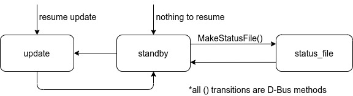

Daemon
======

To start the daemon

.. code-block:: bash

   $ sudo systemctl start oresat-linux-updaterd

State Machine
-------------

.. autoclass:: oresat_linux_updater.updater_daemon.State
   :members:
   :member-order: bysource
   :noindex:

D-Bus API
---------

.. autoclass:: oresat_linux_updater.updater_daemon.UpdaterDaemon
   :members:
   :exclude-members: start, quit
   :noindex:
