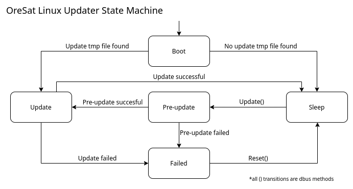

How the OreSat Linux Updater works
==================================

Archive files with deb packages and bash scripts can be sent to the daemon
to update the board over DBus.

State machine
---------------------

States:
    - *Boot* - Setting up file cache.
    - *Sleep* - Waiting for commands.
    - *Pre-update* - Getting and opening the oldest archive file from cache.
    - *Update* - Running the instruction from the opened archive.
    - *Failed* - Updated failed.

